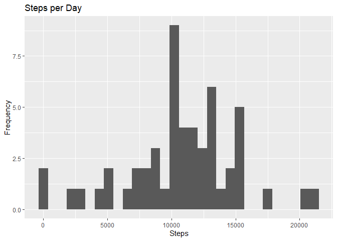
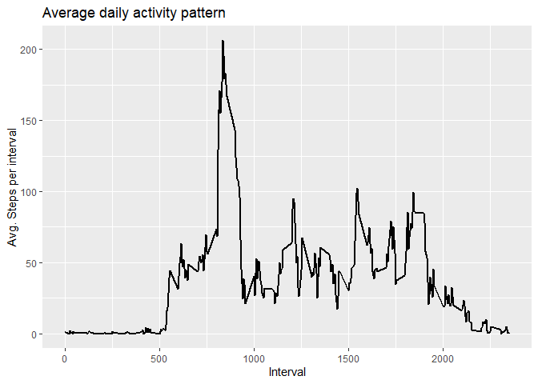
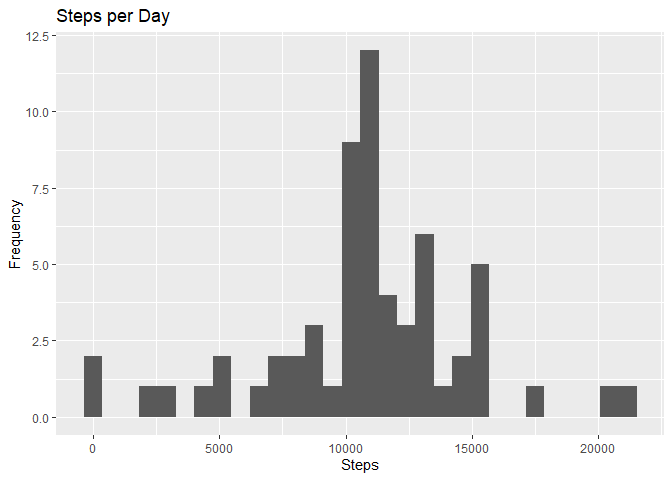
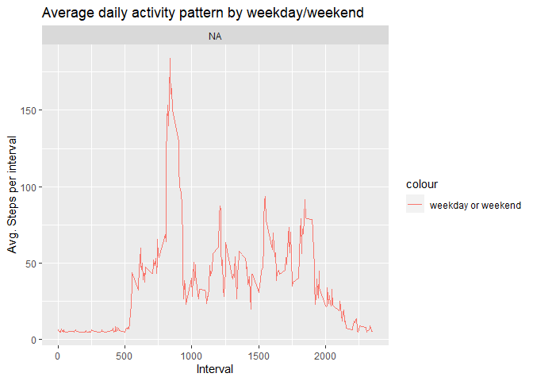

## Introduction

This file describes reproducibly the generation of plots and the analyses performed for project assignment 1 of the cousera course *Reproducible Research*. 

## Loading and preprocessing the data

Load libraries, download zip and unzip it to the working directory.


```r
library("data.table")
library(ggplot2)
fileUrl <- "https://d396qusza40orc.cloudfront.net/repdata/data/activity.zip" 
download.file(fileUrl, destfile = paste0(getwd(), '/activity.zip'), method = "curl")
unzip("activity.zip")
```

Parse csv into data.table: 

```r
activityDT <- data.table::fread(input = "activity.csv")
```

## What is mean total number of steps taken per day?

Calculate the total number of steps taken per day

```r
total_steps <- activityDT[, c(lapply(.SD, sum, na.rm = FALSE)), .SDcols = c("steps"), by = .(date)] 
```

Plot a histogram of the total number of steps taken each day:

```r
ggplot(total_steps, aes(x = steps)) + geom_histogram() + labs(title = "Steps per Day", x = "Steps", y = "Frequency")
```

```
## `stat_bin()` using `bins = 30`. Pick better value with `binwidth`.
```

```
## Warning: Removed 8 rows containing non-finite values (stat_bin).
```

<!-- -->

Calculate and report the mean and median of the total number of steps taken per day

```r
#Total_Steps[, .(Mean_Steps = mean(steps, na.rm = TRUE), Median_Steps = median(steps, na.rm = TRUE))]
mean_steps <- mean(total_steps$steps, na.rm = TRUE)
median_steps <- median(total_steps$steps, na.rm = TRUE)
```

## What is the average daily activity pattern?


```r
IntervalDT <- activityDT[, c(lapply(.SD, mean, na.rm = TRUE)), .SDcols = c("steps"), by = .(interval)] 

ggplot(IntervalDT, aes(x = interval , y = steps)) + geom_line(size=1) + labs(title = "Average daily activity pattern", x = "Interval", y = "Avg. Steps per interval")
```

<!-- -->

```r
IntervalDT[steps == max(steps), .(max_interval = interval)]
```

```
##    max_interval
## 1:          835
```

## Imputing missing values

Calculate the number of NA in the data set:

```r
nrow(activityDT[is.na(steps),])
```

```
## [1] 2304
```

Replace NAs with the mean value for the corresponding day:

```r
cleanedActivityDT <- copy(activityDT)
cleanedActivityDT[is.na(steps), "steps"] <- cleanedActivityDT[, c(lapply(.SD, mean, na.rm = TRUE)), .SDcols = c("steps")]
```

```
## Warning in `[<-.data.table`(`*tmp*`, is.na(steps), "steps", value =
## structure(list(: 37.382600 (type 'double') at RHS position 1 truncated
## (precision lost) when assigning to type 'integer' (column 1 named 'steps')
```

Generate a file based on the combination of the original file and the imputed values:

```r
data.table::fwrite(x = cleanedActivityDT, file = "data/cleanedActivity.csv", quote = FALSE)
```

Generate another histogram based on the new dataset (with imputed data):

```r
total_steps_imputed <- cleanedActivityDT[, c(lapply(.SD, sum, na.rm = FALSE)), .SDcols = c("steps"), by = .(date)] 
ggplot(total_steps_imputed, aes(x = steps)) + geom_histogram() + labs(title = "Steps per Day", x = "Steps", y = "Frequency")
```

```
## `stat_bin()` using `bins = 30`. Pick better value with `binwidth`.
```

<!-- -->

Show the differences in mean and median without and with imputed values:

```r
mean_steps_imputed <- mean(total_steps_imputed$steps)
median_steps_imputed <- median(total_steps_imputed$steps)
mean_steps
```

```
## [1] 10766.19
```

```r
mean_steps_imputed
```

```
## [1] 10751.74
```

```r
median_steps
```

```
## [1] 10765
```

```r
median_steps_imputed
```

```
## [1] 10656
```

## Are there differences in activity patterns between weekdays and weekends?
1. Add a factor to differentiate weekdays and weekends


```r
cleanedActivityDT[, `weekday`:= weekdays(x = date)]
cleanedActivityDT[grepl(pattern = "Monday|Tuesday|Wednesday|Thursday|Friday", x = `weekday`), "weekday or weekend"] <- "weekday"
cleanedActivityDT[grepl(pattern = "Saturday|Sunday", x = `weekday`), "weekday or weekend"] <- "weekend"
cleanedActivityDT[, `weekday or weekend` := as.factor(`weekday or weekend`)]

IntervalDT <- cleanedActivityDT[, c(lapply(.SD, mean, na.rm = TRUE)), .SDcols = c("steps"), by = .(interval, `weekday or weekend`)] 
ggplot(IntervalDT , aes(x = interval , y = steps, color="weekday or weekend")) + geom_line() + labs(title = "Average daily activity pattern by weekday/weekend", x = "Interval", y = "Avg. Steps per interval") + facet_wrap(~`weekday or weekend` , ncol = 1, nrow=2)
```

<!-- -->
